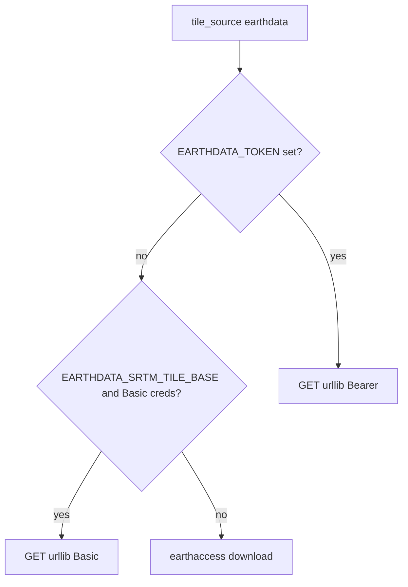

# План (опційний): NASA Earthdata — авторизація Bearer-токеном для тайлів SRTM

Цей документ лише **фіксує**, як можна втілити спосіб з `.env` (`EARTHDATA_TOKEN` + база URL), **не замінюючи** поточну логіку, доки не прийнято рішення. Реалізація може бути відкладена або скорочена (наприклад, лише зовнішній скрипт).

## Поточний стан

- У `modules/geo_module/srtm_tiles.py` для `tile_source == "earthdata"` і наявного **`EARTHDATA_SRTM_TILE_BASE`** використовується **`urllib.request`** з заголовком **`Authorization: Basic …`** з `_earthdata_basic_auth_header()` (`EARTHDATA_USER` + `EARTHDATA_PASSWORD`).
- Якщо база URL відсутня або Basic не зібрався — fallback на **`earthaccess`** (`_download_tile_payload_earthaccess`).
- Креденшали з файлу: `load_earthdata_credentials_from_project_file()` у `main_app/paths.py` — лише **login/password** у стилі .netrc для `EarthData.txt`.
- **`python-dotenv` у проєкті не підключений**; змінні з `.env` потрапляють у процес лише якщо їх виставляє IDE/ОС або додають `load_dotenv` (окреме рішення).

## Цільова поведінка (якщо втілювати)

1. **Нова гілка авторизації** у `download_tile` (блок `earthdata`), коли задано **`EARTHDATA_TOKEN`** (непорожній): будувати той самий URL, що й зараз — `_earthdata_tile_url` (база **`EARTHDATA_SRTM_TILE_BASE`**, підпапка + суфікс), і виконувати GET з заголовками:
   - `Authorization: Bearer <token>`
   - `User-Agent`: як у Basic-гілці
2. **Пріоритет** (пропозиція, узгодити перед кодом):
   - `EARTHDATA_TOKEN` → Bearer HTTP до `EARTHDATA_SRTM_TILE_BASE`;
   - інакше — поточний Basic (`EARTHDATA_USER` + `EARTHDATA_PASSWORD`);
   - інакше — `earthaccess`.
3. **Редіректи:** NASA часто віддає 302 на інший хост — для `urllib.request.urlopen` переконатися, що **слідування редіректам увімкнене** (у Python 3 це типова поведінка; за потреби явно перевірити на 302/403 і повідомлення українською).
4. **Імена змінних:** у коді залишити **`EARTHDATA_SRTM_TILE_BASE`** як єдину базу (опційно в документації згадати, що `SRTM_BASE_URL` з прикладів користувача = те саме, але підтримувати **один** канонічний ключ, щоб не дублювати).
5. **Залежності:** Bearer можна реалізувати **без** `requests`, лише `urllib` + існуючий pipeline розпакування gzip/запис `.hgt` (як у `download_tile` після отримання `payload`). Якщо з’являться проблеми з SSL/редиректами — тоді окремо оцінити додавання `requests` у `requirements-dem.txt`.
6. **`load_dotenv`:** якщо потрібно підхоплювати `.env` автоматично — виклик **один раз** на старті (наприклад `main_app/main.py` або ранній імпорт у `main_app/paths.py`) + додати `python-dotenv` у requirements; **альтернатива** — не чіпати код і документувати лише системні змінні / `EarthData.txt` (токен у env задає користувач ззовні).
7. **Безпека:** не логувати токен; у повідомленнях про помилки — лише HTTP-код і короткий текст без тіла відповіді з секретами.
8. **Документація:** короткий абзац у `PROJECT_CONTEXT.md` або `PROJECT_STATE.md` — коли Bearer увімкнено, що потрібно в env; оновити підказки в UI (`dripcad_legacy.py` / `map_viewer_tk_window.py`), якщо там згадується лише login/password.
9. **Тести:** мінімальний unit-тест на вибір заголовка (мок `os.environ`: лише токен → Bearer; лише user+password → Basic) без реального мережевого виклику.

## Ризики та рішення «чи варто»

- **Сумісність з LP DAAC / e4ftl01:** не всі кінцеві точки приймають Bearer так само, як браузерний скрипт; перед повною інтеграцією варто **перевірити один реальний URL** тайла (наприклад, для зони Києва) з тим самим шляхом, що будує `_earthdata_tile_url`.
- **Дублювання з earthaccess:** якщо Bearer стабільно працює, можна лишити earthaccess запасним; якщо ні — не видаляти існуючий шлях.

## Трека робіт (коротко)

1. Узгодити пріоритет: Bearer vs Basic vs earthaccess та канонічне ім’я базового URL.
2. Розширити `download_tile` / допоміжні функції в `srtm_tiles.py` для Bearer без дублювання URL.
3. Рішення: `load_dotenv` у main/paths + `python-dotenv` або лише документація env.
4. Оновити PROJECT_CONTEXT / підказки UI для токена.
5. Unit-тест вибору заголовка авторизації (мок env).
