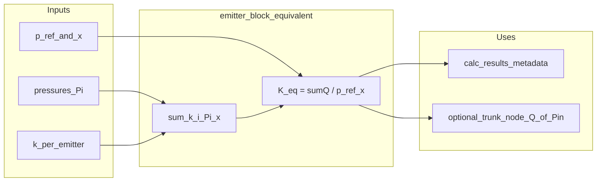

# План: еквівалентна «одна крапельниця» для блоку (K_eq, x)

**Статус:** чернетка плану до реалізації (оновлюйте цей файл після виконання пунктів).

**Огляд:** додати чистий модуль обчислення еквівалентного коефіцієнта K_eq для сукупного виливу некомпенсованих емітерів з однаковим x відносно опорного напору P_ref, плюс тести та опційні точки підключення до гідравлічного пайплайну DripCAD (після повного розрахунку латераля або як окремий DTO для спрощеного вузла).

## Контекст у репозиторії

- Закон виливу вже узгоджений: **`q = k · H^x`** (некомпенсовані), див. `modules/hydraulic_module/lateral_drip_core.py` (`emitter_flow_lph`) та опис у `modules/hydraulic_module/hydraulics_core.py` (`emitter_opts`: `k_coeff`, `x_exp`, `kd_coeff`).
- Багатовузловий розв’язувач використовує **`q_m3s = K · h^x`** через `modules/hydraulic_module/trickle_line_nr_solver.py` (`emitter_K_m3s_and_x`) — одиниці мають бути **узгоджені** (л/год vs м³/с, напір у **м вод. ст.**, не бар).

Математика коректна для **сталого режиму**, якщо **`P_ref` — той самий тип напору**, що й `P_i` (у проєкті це зазвичай п’єзометричний напір на крапельниці з урахуванням рельєфу вздовж ланцюга). Формула:

`K_eq = (Σ_i k_i · P_i^x) / P_ref^x` (при спільному **x**; якщо всі **`k_i` однакові** — `K_eq = k · Σ_i (P_i / P_ref)^x`).

**Обмеження (зафіксувати в docstring):** `K_eq` прив’язаний до обраного **`P_ref`** і до набору **`P_i`** (робоча точка); при суттєвій зміні гідравліки всередині блоку (довжини, діаметрів, рельєфу) профіль `P_i` змінюється — для точності потрібен **перерахунок** `K_eq`. **Перехідні процеси** (заповнення магістралі) цим не покриваються — лише квазістаціонарна модель.

---

## 1. Новий маленький модуль (pure functions + DTO)

Файл на кшталт `modules/hydraulic_module/emitter_block_equivalent.py` (без циклічних імпортів з важких модулів).

**API (мінімум):**

- `equivalent_k_at_ref(*, pressures: Sequence[float], k_each: float | Sequence[float], x: float, p_ref: float, *, clamp_nonpositive: bool = True) -> float`  
  - Реалізація: `num = sum(k_i * max(p_i, eps)**x)`; `den = max(p_ref, eps)**x`; повернути `num/den`.  
  - Якщо `k_each` — скаляр, усі `k_i` однакові.

- `block_flow_at_ref(k_eq: float, x: float, p_in: float) -> float` — зворотна перевірка `k_eq * p_in^x` (у тих самих одиницях, що й вхідні `k`/`q`).

- Опційно **dataclass** `EquivalentEmitterModel(k_eq, x, p_ref_m, meta: dict)` для серіалізації / логів.

**Одиниці:** або документовано «усі q у л/год», або «усі q у м³/с» — узгодити з викликами з `lph_to_m3s` / `emitter_K_m3s_and_x`, щоб не змішувати.

---

## 2. Юніт-тести

Новий файл `tests/test_emitter_block_equivalent.py`:

- Однакові `k`, різні `P_i`, заданий `P_ref`: перевірити, що `k_eq * P_ref^x == Σ k P_i^x` з допуском.
- Випадок `x=0.5`, порівняння з ручним `emitter_flow_lph` по кожній точці vs сума.
- Граничні: дуже малі напори (`eps`), `p_ref` ≤ 0 (поведінка за політикою проєкту — 0 або виняток).

---

## 3. Інтеграція в DripCAD (поетапно, без ламання поточного NR)

**Варіант A — постобробка після повного розрахунку латераля (рекомендований перший крок):**

- Після того як `hydraulics_core` (або шар виклику солвера) має таблицю вузлів з **`q_emit`** і напорами на емітерах, для обраного **блоку**:
  - `Q_total = Σ q_emit`;
  - `P_i` — напір у вузлах випуску (ті самі, що вже використовувались для `q_emit`);
  - `P_ref` — наприклад напір на **врізці латераля в сабмейн** або середній/мінімальний напір на ряду (явний параметр у функції).
- Зберегти в `calc_results` (або окремий ключ) щось на кшталт `block_equivalent_emitter: {k_eq, x, p_ref_m, q_total_lph}` для звітів / експорту / магістралі.

**Варіант B — спрощений вузол для зовнішньої мережі (магістраль / споживач):**

- Окремий DTO у даних споживача (не замінюючи внутрішній NR латераля), щоб на рівні **транка** використовувати один `Q(P_in)` замість N емітерів — лише якщо явно увімкнено в UI/JSON.

Спочатку реалізувати **Варіант A** (мінімальний ризик); **Варіант B** — окремий етап, бо змінює семантику навантаження.

---

## 4. Документація

- Короткий підрозділ у `PROJECT_CONTEXT.md` або коментар у модулі: припущення, одиниці, що `K_eq` не «універсальна константа», а знімок для робочої точки.

---

## Залежності / ризики

- Не плутати **абсолютний тиск у бар** з **напором H у м** у формулах коду.
- Якщо в майбутньому з’являться **різні `x` по емітерах** — потрібна інша агрегація (не цей closed form); поточний план — **один спільний x**.

---

## Чеклист виконання

- [ ] `modules/hydraulic_module/emitter_block_equivalent.py`: `equivalent_k_at_ref`, `block_flow_at_ref`, docstring з припущеннями та одиницями
- [ ] `tests/test_emitter_block_equivalent.py`: узгодженість з Σq, граничні напори, x=0.5 vs `emitter_flow_lph`
- [ ] Опційно: після розрахунку латераля збирати P_i/q_i по блоку і записувати k_eq у `calc_results` (точка виклику в `hydraulics_core` або там, де вже є `block_emit_sum`)
- [ ] Коротко зафіксувати в `PROJECT_CONTEXT.md` або в модулі — межі застосування (сталий режим, прив’язка до P_ref)

---

## Схема потоку (mermaid)

